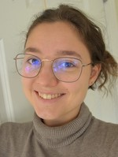

# Course Syllabus: Introduction to Web Development

[TO BE UPDATED FOR THE SPRING 2021 SEMESTER]

An introduction to Internet and Web technologies. Topics include Internet transport protocols, HTML5 and CSS3, Web page design and Website publishing. Emphasis is placed on fundamentals, design concepts and industry standards. Additional topics include: web site construction techniques, mobile design issues, and Search Engine Optimization (SEO). Programming with JavaScript will be introduced.

*The course will be 100% online with asynchronous parts (the lectures), and synchronous parts (the labs)*

## Course Section: **CSC 170-1 - Intro to Web Development - Lecture**

- Meeting Pattern: **Tues/Thurs 11:05 AM - 12:20 PM EDT**
- Credits: **4.0**
- Location: **Online Lecture (asynchronous, Panopto)**
  - As scheduled, students must watch recorded lecture videos in Panopto within 24 hours of being published on Tuesdays and Thursdays

## Course Section: CSC 170-2 - Web Development - Lab or CSC 170-3 - Web Development - Lab 

- Meeting Pattern (CSC 170-2):  **Mon/Wed 11:05 AM - 12:20 PM EDT**
- Meeting Pattern (CSC 170-3):  **Mon/Wed 12:30 PM - 1:45 PM EDT**
- Credits: **0.0** (required for lecture)

- Location: **Live Online Meetings (synchronous, Zoom + recordings in Panopto)**
  - As scheduled, students must attend meetings via Zoom to work on selected assignments with TAs in real-time
  - OR if unable to attend in real-time, watch recordings of the Zoom session in Panopto within 24 hours of being published on Mondays and Wednesdays

## Course Information and Announcements

- All **course documentation** and **assignments** for CSC 170 will be published here: **[docs.csc170.org](http://docs.csc170.org/)**, not in Blackboard.
- All **announcements** for CSC 170 will be distributed via "Slack" - an online communication and collaboration tool, not in Blackboard.

  - Students are required to **create a Slack account here**: [ join.slack.com/t/csc170/signup](https://join.slack.com/t/csc170/signup) and then monitor the CSC 170 Slack Workspace here: **[csc170.slack.com](https://csc170.slack.com/)** throughout the semester.
    - When registering for an account in Slack, students must use their **rochester.edu** email
    - Suggestion: after you setup your Slack account, instead of using Slack via the website, **install the device software**: [slack.com/downloads](https://slack.com/downloads)
- **Blackboard** will be used for students to turn-in assignments and monitor their grade progress throughout the semester.

## Instructor Information 

- Instructor: **Professor Kostin** Instructional Faculty Digital Media Studies Program; Computer Science Department University of Rochester 206a Morey Hall (private office); 2105 Wegmans Hall (shared office)
- **Messaging/Office Hours**
  - e-mail: **<robert.kostin@rochester.edu>** - not recommended due to excessive incoming messages, instead...
  - For faster reply, please use [**Slack**](https://urcsc210.slack.com/) to contact the professor; send a **DM to Professor Kostin**
  - For real-time discussions (**office hours**), schedule an appointment using [**Calendly**, an online scheduling app](https://calendly.com/rkostin) to setup a private Zoom meeting

- Instructor: **Professor Kostin**
- **Messaging**: e-mail: **<robert.kostin@rochester.edu>** (for faster reply, please use [Slack](https://csc170.slack.com/) to contact the professor)

### Teaching Assistants

The following TAs will be online to present assignments, provide suggestions, and answer questions via our **#help channel in Slack**, and in the scheduled **Lab** sessions via Zoom.

- To learn about **assignments**, attend the scheduled Lab sessions
- To get **technical help** in Slack, use the #help channel; the TAs will answer
- To discuss **grades or private matters**, search for the TAs by name and send a DM

|  Bella Ntete Kirenga |  Dominique Dorvil |  Emma Mantel         |
| ------------------------------------------------------------ | ------------------------------------------------------------ | ------------------------------------------------------------ |
|  **Kunda Iradukunda** |  **Robert Petrosyan** |  **Youssef Ouenniche** |

## Grading
For each assignment, a grading rubric will be provided. Rubrics will inform students how assignments are evaluated.  In the interest of fairness, extra credit and make-up work is not offered.  

### Grading Schema

| **Range**      | **Grade** |
| -------------- | --------- |
| 93.00 to 100   | A         |
| 90.00 to 92.99 | A-        |
| 87.00 to 89.99 | B+        |
| 84.00 to 86.99 | B         |
| 80.00 to 83.99 | B-        |
| 77.00 to 79.99 | C+        |
| 74.00 to 76.99 | C         |
| 70.00 to 73.99 | C-        |
| 67.00 to 69.99 | D+        |
| 64.00 to 66.99 | D         |
| 60.00 to 63.99 | D-        |
| 00.00 to 59.99 | E         |

| Activity                                                     | Weight of the final grade                                    |
| ------------------------------------------------------------ | ------------------------------------------------------------ |
| **Lab Assignments** There is lab work once or twice a week at the discretion of the instructor.  Each lab counts equally toward the total of 30%.  There will be around 15-18 lab assignments depending on current changes in the web development industry. NOTE: each lab depends on the success of the previous so students need to keep-up and not skip labs. | **30%** Each lab assignment will be worth about 1.6% of the overall grade |
| **Projects** There are three projects during the semester. Each project depends on the success of the previous. | **70%** Project 1: 10% Project 2: 35% Project 3: 25% |

## Labs and Project Assignments
**Assignments** are made available via the Course Documentation website after most lectures and can be completed independently on one's own Internet-connected computer (Mac or PC).  

**How to get help...**

1. FTP (upload) what you've done so far to your account on the class web server using Cyberduck (Mac) or WinSCP (PC)

2. Check what you uploaded to the server in your web browser and copy the URL

3. Go to the #help channel in Slack and create a post. Ask a SPECIFIC question and paste the URL

   ...Then, the professor will *start a thread* on your post to answer your question

**Note:** throughout the semester, the assignments build on each other, meaning: students cannot complete one assignment without successfully finishing the previous.  So, success in this course requires students to turn-in assignments on-time and in the right order.

### Due Dates
For each assignment and project, the **due date** is shown near the top of the lab instructions. To avoid a zero grade, they must be turned-in via Blackboard on or before their due date.  

Within **24 hours** of turning-in an assignment in Blackboard, the TAs will provide a grade ONE TIME only, and only if the assignment was submitted in Blackboard **on or before its due date**.  

Assignments turned-in after the due date will get a zero.

### Late assignments

Late assignments will not be graded unless *a prior arrangement* has been made with the student's assigned TA to get an **extension by one or two days**.  Extensions will only be granted two or three times, maximum, per semester, at the discretion of the TA. 

## Texts and Materials
This course does not use a textbook. All information required to pass the course comes from the lectures and labs so attendance, virtual or in-person, is mandatory.  

### Personal Computer and Software
In addition to the hosted Web service, provided by the University, students will need to use a personal computer (PC or Mac) with specific capabilities and software installed:

- A code editor
- FTP software
- An updated, popular web browser
- An Internet connection
- A local "web stack" (in the second half of the semester)

If a student does not have a personal computer with these capabilities, the University provides open labs at various locations on campus that they can use directly or through remote access.  Those computers have all the required capabilities and software installed and they are supported by University IT.  

For reference: during lectures the professor will be using a **Macbook** and **Windows PC** (alternatively) and a code editor: **Sublime Text, version 3** ([www.sublimetext.com/3](http://www.sublimetext.com/3)). For FTP demonstrations, the professor will use **Cyberduck** (for Mac, [cyberduck.io](http://cyberduck.io)) and **WinSCP** (for PC, [winscp.net/eng/download.php](http://winscp.net/eng/download.php)).  Demonstrations during the lecture and in labs will be done using **Google Chrome**.

Mid-way through the semester, the professor will introduce web server software that students can optionally install on their own computer.  The software can be installed using the free version of: MAMP (for both PC and Mac, www.mamp.info/en)

## Academic Honesty
Violation of the College's Honesty Policy is a serious violation of the trust upon which our academic community depends. A common form of academic dishonesty is plagiarism: the representation of another person’s work as one’s own, or the attempt “to blur the line between one’s own ideas or words and those borrowed from another source.” ([Council of Writing Program Administrators, January 2003,](http://wpacouncil.org/node/9)). More specifically for CSC 170, **computer code (HTML, CSS, PHP, or JavaScript) submitted for grading, that was copied from another source in part or whole without acknowledgment is plagiarism**.  To protect yourself, in the programming world, citations of sources may be placed in the "code comments" of submitted files.

### Industry Practices
In the web development industry it is common for professional developers to inspect, i.e. look and study someone else's code for the purposes of *inspiration*.  In fact, that's how good developers get better, and in the industry, it's encouraged.  But here in academia there is a line between inspection for inspiration versus plagiarism.  Students must be very careful to not copy other students' code and submit it as their own without proper attribution.  In cases where plagiarism is evident, the University’s rules governing academic dishonesty will be followed. As required by College policy, all instances of plagiarism are reported to the College Board of Academic Honesty.  For the complete College honesty policy, see: [www.rochester.edu/college/honesty](http://www.rochester.edu/college/honesty)

## Academic Assistance and Accommodations
Please know that this classroom respects and welcomes students of all backgrounds and abilities. Students are invited to talk with the professor about any concern or situation that affects their ability to complete their academic work successfully. Useful resources for all students include the Center for Excellence in Teaching and Learning, located at **1-154 Dewey Hall** on the River Campus; telephone: **(585) 275-9049** or email <cetl@rochester.edu>

## Schedule
This [schedule (linked here)](schedule.md) is subject to modification throughout the semester.  Always check with the professor to answer questions about the schedule.
